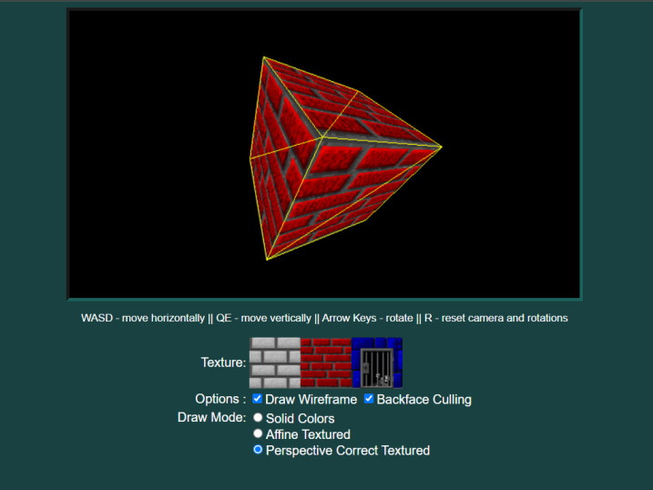

# Affine vs Perspective Correct Texture Mapping

[](https://andrew-lim.github.io/texturedemo/texturedemo.htm)

HTML5 canvas demo demonstrating the differences between affine and perspective-correct texture mapping. Affine texture mapping was used in the original Playstation.

[Try It Here](https://andrew-lim.github.io/texturedemo/texturedemo.htm)

- This demo uses [glMatrix](https://glmatrix.net/) for matrix math.
- The texture mapping routines are `affineTexturedTriangle` and `texturedTriangle` inside [graphics.js](graphics.js)
- The texture images are base64-encoded inside [base64texture.js](base64texture.js)
- Triangles are clipped in clip coordinates using OpenGL style rules
```
−wc ≤ xc ≤ wc
−wc ≤ yc ≤ wc
−wc ≤ zc ≤ wc.
```
- Backface culling is done in NDC (Normalized Device Coordinates) using a 2D version of the cross product that ignores the z-component.