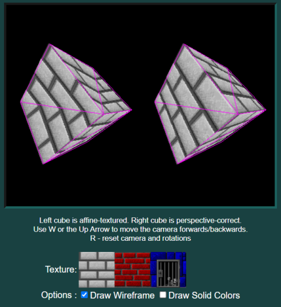

# Affine vs Perspective Correct Texture Mapping

HTML5 canvas demo demonstrating the differences between affine and perspective-correct texture mapping. Affine texture mapping was used in the original Playstation.

[Try It Here](https://andrew-lim.github.io/html5-snake/snake.htm)

- This demo uses the [glMatrix](https://glmatrix.net/) for matrix math.
- The texture mapping routines are `affineTexturedTriangle` and `texturedTriangle` inside [graphics.js](graphics.js)
- The texture images are base64-encoded inside [base64textures.js](base64textures.js)

